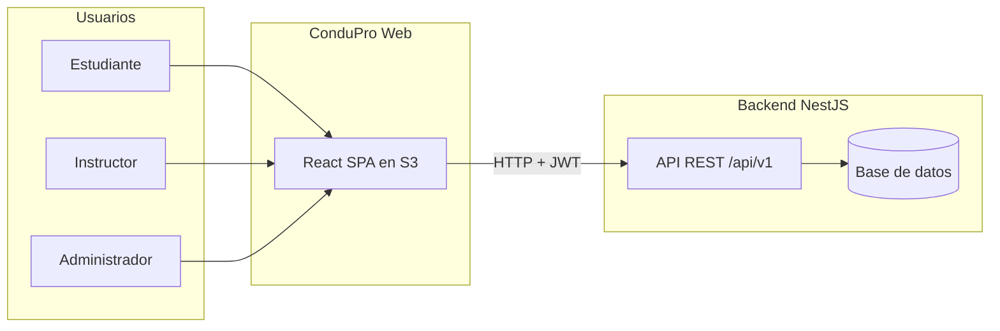
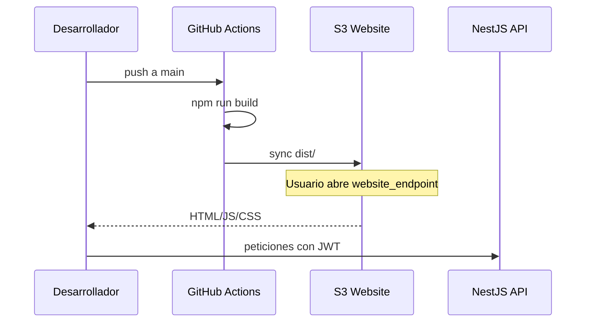

# ConduPro Web — Documento de exposición

> Guía para presentar el proyecto: qué es, qué hace, cómo se construyó y cómo se despliega en producción.

---

## 1. ¿Qué es ConduPro?

**ConduPro** es una plataforma web de gestión para **escuelas de conducción**. Centraliza en un solo lugar lo que antes se repartía entre agendas en papel, WhatsApp, hojas de cálculo y llamadas:

- Reserva de clases teóricas y prácticas
- Seguimiento del progreso del estudiante hacia su licencia
- Gestión de instructores, vehículos y flota
- Reportes operativos para la administración

Este repositorio (**ConduPro-web**) es el **frontend**: la interfaz que ven estudiantes, instructores y administradores. Se conecta a un **backend NestJS** (API REST) que persiste datos, autentica usuarios y aplica reglas de negocio.



---

## 2. Problema que resuelve

| Antes (manual) | Con ConduPro |
|----------------|--------------|
| Coordinar horarios por mensajes | Agendamiento con cupos y disponibilidad en tiempo real |
| No saber qué vehículo o instructor está libre | El sistema asigna recursos según reglas del backend |
| Materiales repartidos sin control | Repositorio de material teórico por tema y licencia |
| Poca visibilidad para la escuela | Panel admin con usuarios, flota, cursos y reportes |

La web no reemplaza la enseñanza en carretera: **organiza la operación** de la escuela para que instructores y estudiantes se enfoquen en aprender y enseñar.

---

## 3. Tres roles, una plataforma

Cada usuario inicia sesión y ve **solo lo que su rol permite**. Las rutas están protegidas en el router (`ProtectedRoute` + `RoleRoute`).

### Estudiante

| Sección | Función |
|---------|---------|
| **Dashboard** | Resumen de progreso, licencia activa y próximas clases |
| **Mis clases** | Historial y gestión de clases agendadas |
| **Agendar clase** | Flujo en dos pasos: teórica o práctica |
| **Mis licencias** | Avance por categoría (temario teórico + prácticas) |
| **Material de estudio** | Descarga de PDFs y diapositivas de clases teóricas |

**Flujo típico:** registrarse → iniciar sesión → agendar clase teórica o práctica → consultar horarios y materiales.

### Instructor

| Sección | Función |
|---------|---------|
| **Dashboard** | Resumen de clases de la semana |
| **Mis clases** | Clases que imparte (prácticas y teóricas) |
| **Disponibilidad** | Grilla semanal (lun–vie) para marcar franjas libres |
| **Material teórico** | Subida de archivos por tema para estudiantes matriculados |

**Flujo típico:** marcar disponibilidad → ver clases asignadas → subir material para sus grupos.

### Administrador

| Sección | Función |
|---------|---------|
| **Dashboard** | Vista general de la escuela |
| **Usuarios** | CRUD de estudiantes, instructores y admins |
| **Agendamientos** | Todas las clases del sistema |
| **Vehículos** | Inventario de la flota |
| **Cursos y licencias** | Categorías de conducción y temario teórico |
| **Reportes** | KPIs, gráficas (Recharts) y métricas operativas |

**Flujo típico:** dar de alta usuarios y vehículos → configurar cursos/licencias → revisar reportes y ocupación.

---

## 4. Página pública (landing)

En la ruta `/` hay una **landing de marketing** (no requiere login):

- Hero con animación 3D (escena con ciudad y carretera)
- Sección de características (agendamiento, roles, reportes, seguridad)
- Tabs por rol (estudiante / instructor / admin)
- Estadísticas y llamadas a la acción (registro / login)

Si el usuario **ya está autenticado**, se redirige automáticamente a su dashboard según el rol.

---

## 5. Stack tecnológico

| Capa | Tecnología | Para qué |
|------|------------|----------|
| UI | React 18 + TypeScript (strict) | Componentes tipados y mantenibles |
| Build | Vite 5 | Desarrollo rápido y bundles optimizados |
| Estilos | Tailwind CSS 3 | Design system propio (sin MUI/Chakra) |
| Rutas | React Router 6 | Lazy loading + rutas por rol |
| Datos | TanStack Query 5 | Cache, revalidación y estados de carga |
| Formularios | React Hook Form + Zod | Validación en cliente |
| HTTP | Axios | JWT + refresh silencioso de token |
| Estado UI | Zustand | Tema claro/oscuro y preferencias locales |
| Gráficas | Recharts | Reportes del admin |
| 3D | Three.js (hero) | Impacto visual en la landing |
| Animaciones | Framer Motion | Transiciones y micro-interacciones |
| PWA | vite-plugin-pwa | Instalable, service worker en producción |

**API de producción:** `http://18.223.229.175` (configurada en el workflow de deploy).

---

## 6. Arquitectura del frontend

```
src/
├── api/           # Llamadas al backend (auth, users, schedules, vehicles, …)
├── components/
│   ├── ui/        # Design system (Button, Input, Modal, Table, …)
│   ├── layout/    # Shell, sidebar, navbar, tema
│   ├── landing/   # Secciones públicas
│   ├── student/   # Agendamiento, licencias, materiales
│   ├── instructor/ # Disponibilidad, horarios
│   └── admin/     # Formularios, KPIs, gráficas
├── hooks/         # useAuth, schedules, curriculum, …
├── pages/         # Una página por ruta principal
├── router/        # Rutas + guards por rol
├── providers/     # Auth, Query, Theme, Toast, tour guiado
└── types/         # Contratos TypeScript alineados al API
```

### Autenticación

- **Login / registro** con validación y indicador de fortaleza de contraseña.
- **Access token** en memoria; **refresh token** en `localStorage` (adecuado para desarrollo; en producción idealmente cookie httpOnly del backend).
- Interceptores Axios: ante un 401, intenta refresh y reintenta la petición sin sacar al usuario de la app.

### Design system

- Color primario: violeta eléctrico (`#7C3AED`).
- Modo **claro y oscuro** con tokens semánticos.
- Tipografía: **Plus Jakarta Sans**.
- Componentes propios documentados en desarrollo en `/dev/components` (storybook manual).

### Experiencia extra

- **Tour guiado** para nuevos usuarios en paneles internos.
- **PWA**: puede instalarse como app; assets con caché largo, `index.html` y service worker sin caché agresivo.
- **Responsive** y estados vacíos / errores globales unificados.
- **Accesibilidad**: soporte de `prefers-reduced-motion`, foco visible, ARIA en componentes clave.

---

## 7. Fases del desarrollo (cronología del proyecto)

El trabajo se organizó en **seis fases** incrementales, todas completadas en el historial de Git:

| Fase | Contenido | Estado |
|------|-----------|--------|
| **1** | Scaffold del proyecto + design system (botones, inputs, tablas, modales) | ✅ |
| **2** | Autenticación: login, registro, guards, refresh JWT | ✅ |
| **3** | Vistas del **estudiante**: dashboard, agendar, licencias, materiales | ✅ |
| **4** | Vistas del **instructor**: horarios, disponibilidad semanal, materiales | ✅ |
| **5** | **Panel admin**: usuarios, agendamientos, vehículos, cursos, reportes | ✅ |
| **6** | Polish: PWA, errores globales, empty states, accesibilidad, responsive | ✅ |

**Mejoras posteriores** (commits recientes):

- Integración API más robusta y manejo de errores centralizado.
- Sección **Cursos y licencias** en admin.
- Refinamiento de agendamiento y licencias.
- Tours guiados y UX del instructor.
- Landing con **Three.js** (partículas, carretera, auto).
- Rediseño estético “Apple-minimal” y **modo oscuro**.
- **Despliegue a AWS S3** con Terraform + GitHub Actions.

---

## 8. Despliegue en la nube (lo más reciente)

Objetivo: publicar el frontend como **sitio estático** sin servidor Node en producción.

### Infraestructura (Terraform)

Carpeta: `infra/terraform/`

| Recurso | Propósito |
|---------|-----------|
| **Bucket S3** | Hosting del build (`dist/`) |
| **Website configuration** | `index.html` como documento de error → soporte **SPA** (rutas como `/login` funcionan al recargar) |
| **Política pública** | Solo lectura de objetos para visitantes |
| **OIDC GitHub ↔ AWS** | Login federado sin guardar claves AWS en GitHub |
| **Rol IAM** | Solo el repo/rama `main` puede subir archivos al bucket |

Outputs importantes tras `terraform apply`:

- `website_endpoint` → URL pública del sitio
- `github_actions_role_arn` → secret en GitHub
- `bucket_name` y `aws_region` → variables del workflow

### CI/CD (GitHub Actions)

Archivo: `.github/workflows/deploy.yml`

En cada **push a `main`**:

1. `npm ci` y `npm run build` (con `VITE_API_URL` de producción)
2. Autenticación en AWS vía OIDC (rol IAM)
3. `aws s3 sync` de `dist/` con estrategia de caché:
   - Assets con hash: caché largo (1 año)
   - `index.html`, `sw.js` y workbox: sin caché (despliegues instantáneos)

### CORS

El frontend en S3 llama al API en otra URL. El **backend NestJS** debe permitir el origen exacto del `website_endpoint` de S3; si no, el login falla en el navegador aunque el deploy sea correcto.



---

## 9. Guion sugerido para la exposición (10–15 min)

1. **Contexto (1 min)** — Escuelas de conducción y el caos de coordinar horarios manualmente.
2. **Demo landing (2 min)** — Hero 3D, tres roles, CTA a registro.
3. **Demo estudiante (3 min)** — Login → dashboard → agendar clase teórica o práctica → ver licencias/materiales.
4. **Demo instructor (2 min)** — Disponibilidad semanal → listado de clases.
5. **Demo admin (3 min)** — Usuarios, vehículos, cursos, reportes con gráficas.
6. **Arquitectura técnica (2 min)** — React + API NestJS; mostrar diagrama de la sección 1.
7. **DevOps (2 min)** — Terraform + GitHub Actions + S3; mencionar OIDC sin secrets de AWS en el repo.
8. **Cierre (1 min)** — Fases completadas, PWA, modo oscuro, próximos pasos (HTTPS/CloudFront, cookies httpOnly, etc.).

### Credenciales y entorno

- Desarrollo local: `npm run dev` → `http://localhost:5173`
- API local (opcional): `.env.local` con `VITE_API_URL=http://localhost:3000`
- Producción: URL del output `website_endpoint` de Terraform

---

## 10. Integración con el backend

El frontend consume el API versionado:

```
{VITE_API_URL}/api/v1/...
```

Dominios principales expuestos en `src/api/`:

- `auth` — login, registro, refresh
- `users` — gestión de usuarios (admin)
- `schedules` — clases y agendamientos
- `enrollments` — matrículas del estudiante
- `curriculum` — temario y licencias
- `theoryClassOffers` / `practiceClassOffers` — cupos para agendar
- `theoryMaterials` — archivos de estudio
- `vehicles` — flota
- `reports` — métricas para gráficas

Las respuestas siguen un **envelope** `{ data, timestamp, meta? }` que Axios desenvuelve automáticamente.

---

## 11. Puntos fuertes para destacar ante el jurado

- **Producto completo por roles**, no solo un CRUD genérico.
- **Design system propio** — coherencia visual sin depender de librerías de UI pesadas.
- **Buenas prácticas modernas**: TypeScript estricto, lazy routes, React Query, validación Zod.
- **Seguridad consciente**: rutas por rol, JWT con refresh, despliegue con IAM mínimo (OIDC).
- **DevOps reproducible**: infra como código (Terraform) + pipeline automático.
- **Detalle de UX**: modo oscuro, PWA, tours, animaciones con respeto a `prefers-reduced-motion`.

---

## 12. Limitaciones actuales (honestidad técnica)

Útil mencionarlas si preguntan en Q&A:

| Tema | Situación actual |
|------|------------------|
| HTTPS | Sitio S3 en **HTTP** (sin CloudFront/certificado aún) |
| Refresh token | En `localStorage`; ideal migrar a cookie httpOnly del backend |
| Notificaciones push/email | Descritas en marketing; dependen de implementación en backend |
| CloudFront / CDN | No desplegado; solo S3 static website |

---

## 13. Comandos rápidos de referencia

```bash
# Desarrollo
npm run dev

# Verificar tipos y build
npm run typecheck
npm run build

# Infraestructura (una vez)
cd infra/terraform
terraform init
terraform apply

# Tras el apply, configurar en GitHub:
# Secret:  AWS_ROLE_ARN
# Vars:    AWS_REGION, S3_BUCKET
```

---

## 14. Resumen en una frase

**ConduPro Web** es el frontend de una plataforma para escuelas de conducción que conecta estudiantes, instructores y administradores mediante agendamiento inteligente, seguimiento de licencias y reportes — construido con React y desplegado automáticamente a AWS S3 con Terraform y GitHub Actions.

---

*Documento generado para exposición académica / demostración del proyecto ConduPro-web.*
